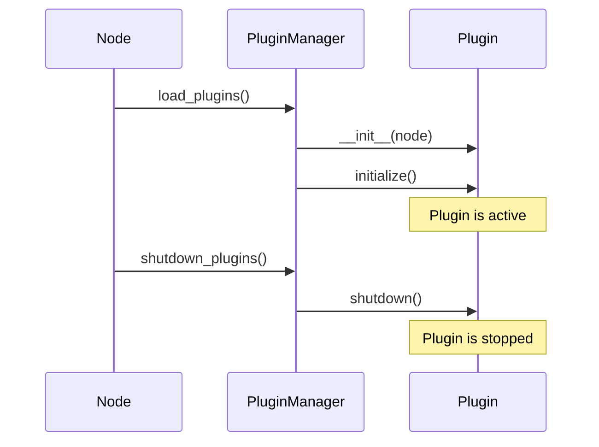

# Plugin Development

DataMgmt Node supports a plugin system for extending functionality. This guide covers creating, installing, and managing plugins.

## Overview

Plugins can:

- Add custom data processing logic
- Integrate with external services
- Implement custom compliance rules
- Extend API functionality
- Add custom event handlers

## Plugin Structure

Plugins are Python modules placed in the `plugins/` directory. Each plugin follows a naming convention:

```
plugins/
├── __init__.py
├── audit_plugin.py      # Class: AuditPlugin
├── backup_plugin.py     # Class: BackupPlugin
└── notify_plugin.py     # Class: NotifyPlugin
```

### Naming Convention

| File Name | Expected Class Name |
|-----------|---------------------|
| `example_plugin.py` | `Example_pluginPlugin` |
| `audit_plugin.py` | `Audit_pluginPlugin` |
| `custom_plugin.py` | `Custom_pluginPlugin` |

!!! note
    The class name is derived from the filename: capitalize the module name and append `Plugin`.

## Creating a Plugin

### Basic Plugin Template

```python
# plugins/example_plugin.py
import logging

logger = logging.getLogger(__name__)


class Example_pluginPlugin:
    """Example plugin for DataMgmt Node.

    This plugin demonstrates the basic structure and available hooks.
    """

    def __init__(self, node):
        """Initialize the plugin.

        Args:
            node: The Node instance, providing access to all services.
        """
        self.node = node
        self.name = "Example Plugin"
        self.version = "1.0.0"

    def initialize(self):
        """Called when the plugin is loaded.

        Use this to:
        - Set up resources
        - Register event handlers
        - Initialize connections
        """
        logger.info(f"{self.name} v{self.version} initialized")

        # Example: Subscribe to events
        self.node.event_bus.subscribe(
            EventType.DATA_SHARED,
            self.on_data_shared
        )

    def shutdown(self):
        """Called when the node is stopping.

        Use this to:
        - Clean up resources
        - Close connections
        - Save state
        """
        logger.info(f"{self.name} shutting down")

    async def on_data_shared(self, event):
        """Handle data shared events."""
        data_hash = event.data.get('data_hash')
        logger.info(f"Data shared: {data_hash[:16]}...")
```

### Accessing Node Services

Plugins have full access to the node instance:

```python
class My_pluginPlugin:
    def __init__(self, node):
        self.node = node

    def initialize(self):
        # Access blockchain interface
        balance = self.node.blockchain_interface.get_balance(address)

        # Access data manager
        data = self.node.data_manager.get_data(hash)

        # Access token manager
        tokens = self.node.token_manager.supported_tokens

        # Access P2P network
        peers = self.node.p2p_network.get_connected_peers()

        # Access compliance manager
        history = self.node.compliance_manager.get_compliance_history()

        # Encrypt/decrypt data
        encrypted = self.node.encrypt_data("secret")
        decrypted = self.node.decrypt_data(encrypted)

        # Publish events to dashboard
        await self.node.event_bus.publish(Event(
            type=EventType.COMPLIANCE_EVENT,
            data={'custom': 'data'}
        ))
```

## Plugin Examples

### Audit Logger Plugin

Log all data operations to a file:

```python
# plugins/audit_plugin.py
import json
import logging
from datetime import datetime
from pathlib import Path

from dashboard.event_bus import EventType

logger = logging.getLogger(__name__)


class Audit_pluginPlugin:
    """Audit logging plugin for compliance tracking."""

    def __init__(self, node):
        self.node = node
        self.audit_file = Path(node.config.data_dir) / 'audit.log'

    def initialize(self):
        # Subscribe to relevant events
        events = [
            EventType.DATA_SHARED,
            EventType.DATA_RECEIVED,
            EventType.TRANSFER_COMPLETED,
            EventType.TRANSFER_FAILED,
        ]

        for event_type in events:
            self.node.event_bus.subscribe(event_type, self._log_event)

        logger.info(f"Audit plugin initialized, logging to {self.audit_file}")

    def shutdown(self):
        self._log_entry("SHUTDOWN", {"node_id": self.node.config.node_id})

    async def _log_event(self, event):
        """Log event to audit file."""
        self._log_entry(event.type.value, event.data)

    def _log_entry(self, event_type: str, data: dict):
        """Write audit log entry."""
        entry = {
            'timestamp': datetime.utcnow().isoformat(),
            'node_id': self.node.config.node_id,
            'event': event_type,
            'data': data
        }

        with open(self.audit_file, 'a') as f:
            f.write(json.dumps(entry) + '\n')
```

### Webhook Notification Plugin

Send notifications to external services:

```python
# plugins/webhook_plugin.py
import aiohttp
import logging

from dashboard.event_bus import EventType

logger = logging.getLogger(__name__)


class Webhook_pluginPlugin:
    """Send webhook notifications for important events."""

    WEBHOOK_URL = "https://hooks.example.com/notify"

    def __init__(self, node):
        self.node = node
        self.session = None

    def initialize(self):
        self.session = aiohttp.ClientSession()

        # Subscribe to important events
        self.node.event_bus.subscribe(
            EventType.TRANSFER_COMPLETED,
            self._notify
        )
        self.node.event_bus.subscribe(
            EventType.ERROR,
            self._notify
        )

        logger.info("Webhook plugin initialized")

    def shutdown(self):
        if self.session:
            # Note: In real code, use async cleanup
            pass

    async def _notify(self, event):
        """Send webhook notification."""
        try:
            payload = {
                'event': event.type.value,
                'data': event.data,
                'timestamp': event.timestamp,
                'node_id': self.node.config.node_id
            }

            async with self.session.post(
                self.WEBHOOK_URL,
                json=payload,
                timeout=aiohttp.ClientTimeout(total=5)
            ) as response:
                if response.status != 200:
                    logger.warning(f"Webhook failed: {response.status}")

        except Exception as e:
            logger.error(f"Webhook error: {e}")
```

### Data Validation Plugin

Add custom data validation before sharing:

```python
# plugins/validation_plugin.py
import json
import logging
import re

logger = logging.getLogger(__name__)


class Validation_pluginPlugin:
    """Validate data before sharing."""

    # Patterns to block (PII, secrets, etc.)
    BLOCKED_PATTERNS = [
        r'\b\d{3}-\d{2}-\d{4}\b',  # SSN
        r'\b\d{16}\b',             # Credit card
        r'password\s*[:=]\s*\S+',  # Passwords
        r'api[_-]?key\s*[:=]\s*\S+',  # API keys
    ]

    def __init__(self, node):
        self.node = node
        self._original_share = None

    def initialize(self):
        # Wrap the share_data method
        self._original_share = self.node.share_data
        self.node.share_data = self._validated_share

        logger.info("Validation plugin initialized")

    def shutdown(self):
        # Restore original method
        if self._original_share:
            self.node.share_data = self._original_share

    async def _validated_share(self, data, recipient, **kwargs):
        """Validate data before sharing."""
        # Check for blocked patterns
        data_str = str(data)

        for pattern in self.BLOCKED_PATTERNS:
            if re.search(pattern, data_str, re.IGNORECASE):
                raise ValueError(
                    f"Data contains blocked pattern: {pattern}"
                )

        # Check data size
        if len(data_str) > 1024 * 1024:  # 1MB
            raise ValueError("Data exceeds maximum size (1MB)")

        # Call original method
        return await self._original_share(data, recipient, **kwargs)
```

## Configuration

### Plugin Directory

Set the plugin directory in your `.env`:

```bash
PLUGIN_DIR=./plugins
```

Or use an absolute path:

```bash
PLUGIN_DIR=/opt/datamgmt/plugins
```

### Plugin Configuration Files

Plugins can read their own configuration:

```python
# plugins/configurable_plugin.py
import json
from pathlib import Path


class Configurable_pluginPlugin:
    def __init__(self, node):
        self.node = node
        self.config = self._load_config()

    def _load_config(self):
        config_file = Path(self.node.config.plugin_dir) / 'configurable.json'

        if config_file.exists():
            with open(config_file) as f:
                return json.load(f)

        return {'enabled': True}  # Defaults
```

## Plugin Lifecycle



### Lifecycle Methods

| Method | When Called | Purpose |
|--------|-------------|---------|
| `__init__(node)` | Plugin instantiation | Store node reference, set up instance |
| `initialize()` | After construction | Start services, subscribe to events |
| `shutdown()` | Node stopping | Clean up resources, save state |

## Best Practices

### Error Handling

Always handle errors gracefully:

```python
def initialize(self):
    try:
        self._setup_resources()
    except Exception as e:
        logger.error(f"Plugin init failed: {e}")
        # Don't raise - allow node to continue
```

### Async Operations

Use async for I/O operations:

```python
async def on_event(self, event):
    async with aiohttp.ClientSession() as session:
        await session.post(url, json=event.data)
```

### Resource Cleanup

Always clean up in shutdown:

```python
def shutdown(self):
    if self.connection:
        self.connection.close()
    if self.file_handle:
        self.file_handle.close()
```

### Logging

Use module-level loggers:

```python
import logging
logger = logging.getLogger(__name__)

# Use appropriate levels
logger.debug("Detailed info")
logger.info("Normal operation")
logger.warning("Unexpected but handled")
logger.error("Errors needing attention")
```

## Debugging Plugins

### Enable Debug Logging

```python
# In your plugin
import logging
logging.getLogger(__name__).setLevel(logging.DEBUG)
```

### Check Plugin Loading

```python
# In Python console
from datamgmtnode.services.plugin_manager import PluginManager

pm = PluginManager(node, './plugins')
pm.load_plugins()
print(pm.plugins)  # See loaded plugins
```

### Common Issues

| Issue | Cause | Solution |
|-------|-------|----------|
| Plugin not loading | Wrong class name | Check naming convention |
| Import error | Missing dependency | Install required packages |
| Plugin crashes node | Unhandled exception | Add try/except in initialize() |
| Events not received | Wrong subscription | Verify EventType enum value |

## See Also

- [Architecture](architecture.md) - System architecture
- [API Reference](../user-guide/api-reference.md) - API documentation
- [Testing](testing.md) - Testing plugins
