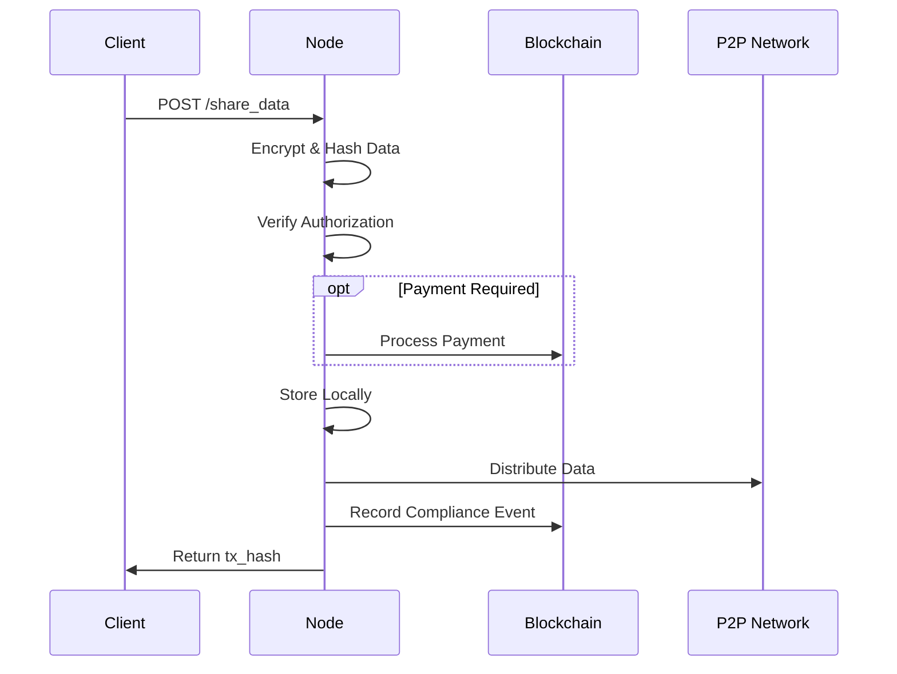

# Overview

DataMgmt Node provides a complete solution for decentralized enterprise data management. This guide covers the core concepts and workflows.

## Core Concepts

### Data Sharing

Data sharing is the primary function of DataMgmt Node. When you share data:

1. **Encryption** - Data is encrypted using Fernet symmetric encryption
2. **Hashing** - A SHA-256 hash is computed for integrity verification
3. **Authorization** - Transfer is authorized using RSA signatures
4. **Payment** (optional) - Token payment is processed if specified
5. **Storage** - Encrypted data is stored locally and distributed via P2P
6. **Compliance** - The operation is recorded on the blockchain



### Encryption Keys

DataMgmt Node uses a hierarchical key management system:

- **Master Password** - Protects all encryption keys at rest
- **Data Keys** - Fernet keys for encrypting shared data
- **Key Versioning** - Supports key rotation without losing access to old data

### P2P Network

The peer-to-peer network uses Kademlia DHT for:

- **Peer Discovery** - Finding and connecting to other nodes
- **Data Distribution** - Storing and retrieving data across the network
- **Health Monitoring** - Tracking peer availability and performance

### Compliance Tracking

All operations are recorded on the blockchain:

- **Data Shares** - Who shared what with whom
- **Payments** - Token transfers associated with data
- **Timestamps** - When operations occurred

## Node Components

### Services

| Service | Description |
|---------|-------------|
| **DataManager** | Local data storage using LevelDB/RocksDB |
| **TokenManager** | ERC-20 token management |
| **PaymentProcessor** | Token transfer processing |
| **ComplianceManager** | Blockchain event recording |
| **KeyManager** | Secure encryption key storage |
| **AuthorizationModule** | RSA signature verification |

### APIs

| API | Port | Purpose |
|-----|------|---------|
| **Internal API** | 8080 | Node management, token operations |
| **External API** | 8081 | Data sharing, public endpoints |
| **Dashboard API** | 8082 | Web dashboard, TUI, WebSocket |

### User Interfaces

DataMgmt Node provides two interfaces for monitoring and management:

| Interface | Description |
|-----------|-------------|
| **[Web Dashboard](web-dashboard.md)** | Browser-based Vue.js dashboard with real-time updates |
| **[Terminal UI](terminal-ui.md)** | Command-line dashboard built with Python Textual |

Both interfaces connect to the Dashboard API and receive real-time updates via WebSocket.

### Network

| Component | Technology | Purpose |
|-----------|------------|---------|
| **P2P Network** | Kademlia DHT | Decentralized data distribution |
| **Blockchain** | EVM (Ethereum, Polygon, etc.) | Compliance and payments |

## Workflows

### Sharing Data

```python
import requests

# Share data with recipient
response = requests.post(
    "http://localhost:8081/share_data",
    headers={"X-API-Key": "your-key"},
    json={
        "data": "Sensitive business data",
        "recipient": "0x742d35Cc6634C0532925a3b844Bc9e7595f1dE01"
    }
)

# Get the transaction hash
tx_hash = response.json()["tx_hash"]
print(f"Data shared! Transaction: {tx_hash}")
```

### Retrieving Data

```python
# Retrieve data by hash
data_hash = "abc123..."
response = requests.get(
    f"http://localhost:8081/data/{data_hash}",
    headers={"X-API-Key": "your-key"}
)

data = response.json()["data"]
```

### Verifying Compliance

```python
# Verify data was shared compliantly
response = requests.get(
    f"http://localhost:8081/verify_data/{data_hash}"
)

is_verified = response.json()["verified"]
```

## Security Model

### Authentication

- **API Keys** - Required for protected endpoints
- **Node Signatures** - RSA signatures for authorization
- **Blockchain Identity** - Ethereum addresses identify participants

### Encryption

- **At Rest** - Keys encrypted with PBKDF2-derived master key
- **In Transit** - Data encrypted before transmission
- **Key Rotation** - Support for periodic key rotation

### Access Control

- **Rate Limiting** - Token bucket algorithm per IP
- **Input Validation** - All inputs validated before processing
- **Middleware** - Centralized error handling

## Next Steps

- [Web Dashboard](web-dashboard.md) - Browser-based monitoring interface
- [Terminal UI](terminal-ui.md) - Command-line dashboard
- [Data Sharing Guide](data-sharing.md) - Detailed data sharing workflows
- [API Reference](api-reference.md) - Complete API documentation
- [Security Guide](../operations/security.md) - Security best practices
